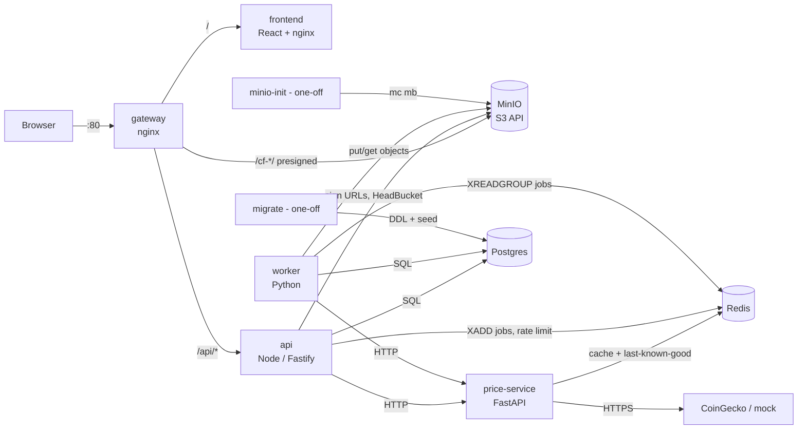

# Architecture

## Topology

Networks: `edge` = gateway, frontend, api, minio. `backend` = api, price-service, worker, postgres, redis, minio.
Only the gateway publishes a port.

## Request flows

**Login.** `POST /api/auth/login` → api checks the Redis rate limit (`ratelimit:login:<ip>`) and bcrypt-verifies the password.
It returns a 15-minute JWT access token in the body and a 7-day refresh token as an httpOnly cookie (`path=/api/auth`).
The SPA keeps the access token in memory. On a 401 it calls `POST /api/auth/refresh` once and retries.

**Holdings.** `GET /api/portfolios/:id/holdings` → api loads the transactions from Postgres. It asks the price-service
for `/prices?ids=…`, which answers from Redis (`cache:price:<id>`, 60 s), from the provider, or from
`lkg:price:<id>` with `stale: true` when the provider is down. The api then computes average-cost P/L.
If the price-service is unreachable, the api still answers with `valueUsd: null` and `stale: true`.

**Background job (export/import/report).**
1. `POST /api/jobs` → the api inserts `jobs(status=queued)` and runs `XADD jobs * job_id <id>`.
2. A worker `XREADGROUP`s it, sets `status=running`, runs the handler and writes the object to `cf-exports/<user>/<job>.csv|pdf`.
3. The worker stores `result_key` and `XACK`s the message.
4. Retry rules: transient errors re-queue the job (max 3 attempts); bad input fails it immediately; messages from dead workers are reclaimed with `XAUTOCLAIM`.
5. The SPA polls `GET /api/jobs` and gets a presigned download URL when the job is done.

**Upload (avatar / CSV import).** SPA → `POST /api/me/avatar/upload-url` (or `/api/uploads/import-url`) → the api
signs a PUT URL for `http://<public host>/<bucket>/<userId>/<uuid>` (15 min). The browser PUTs the file through
the gateway straight to MinIO, then tells the api the object key. The key must start with the caller's user id.

**Price alerts.** The worker scheduler runs every 60 s. It loads active alerts, fetches their prices, and for each match
it atomically sets `active=false` (safe with many workers) and inserts a notification. The SPA polls notifications every 30 s.

**Snapshots.** Every hour at :00 (and at worker start) the worker upserts `portfolio_snapshots(portfolio, today)` with
Σ quantity × price. The dashboard's 30-day chart reads these rows.

## Cross-cutting conventions

| Concern | Convention |
|---------|------------|
| Config | env vars only (`.env.example`); fail fast on missing values |
| Health | `healthz` = process alive (no dependency checks); `readyz` = dependencies OK (503 otherwise) |
| Metrics | Prometheus text at `/metrics` (api: `:3000/metrics`, price-service: `:8000/metrics`, worker: `:9100/metrics`) |
| Logs | one JSON object per line on stdout, including `service` and the request id (`x-request-id`, minted by the gateway) |
| Containers | multi-stage builds, `test` stage per service, non-root users, graceful SIGTERM |
| Data | migrations are forward-only SQL in `services/api/migrations`, applied by the `migrate` job with an advisory lock |
